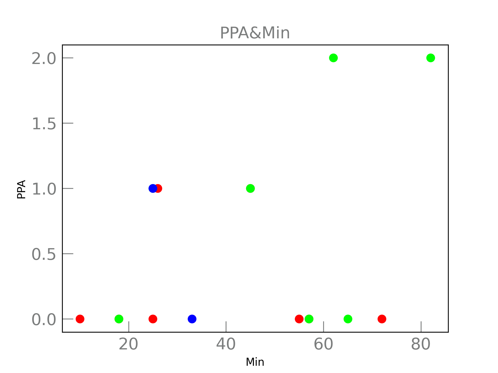
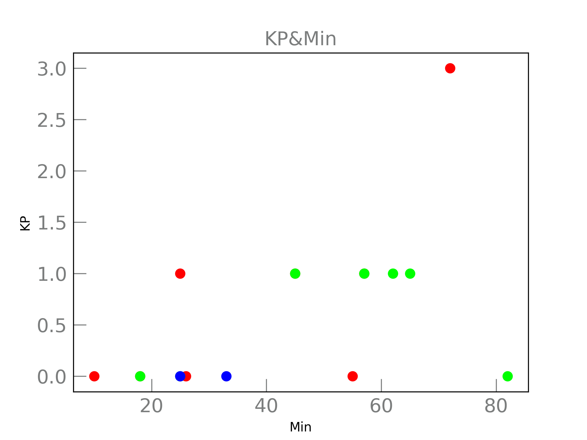
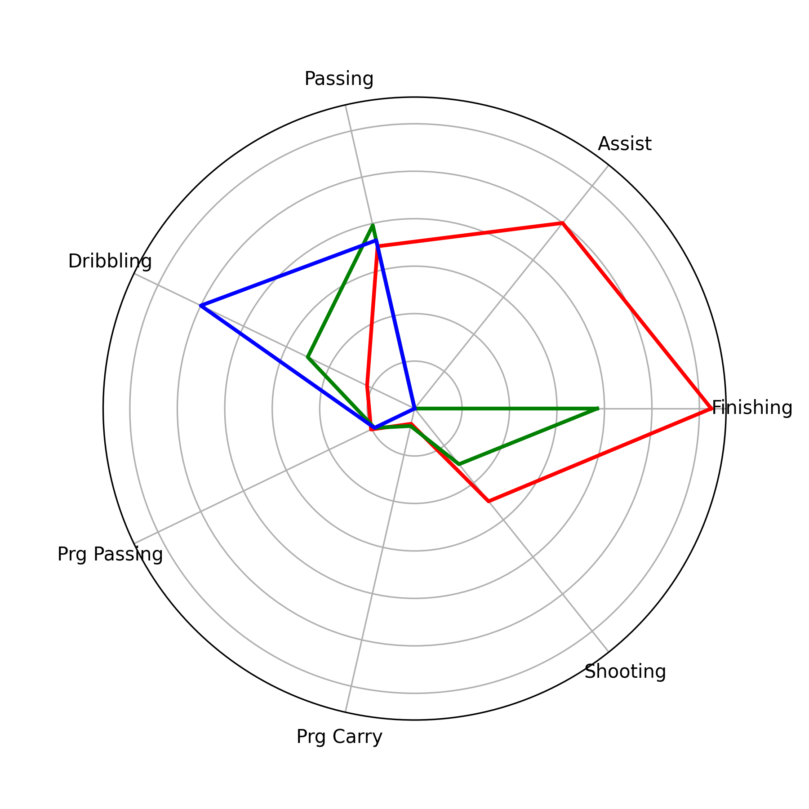
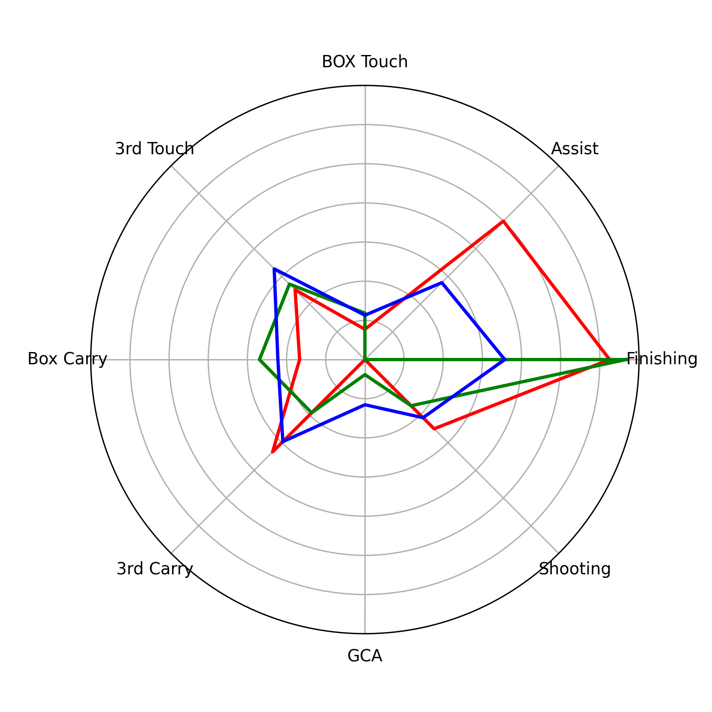
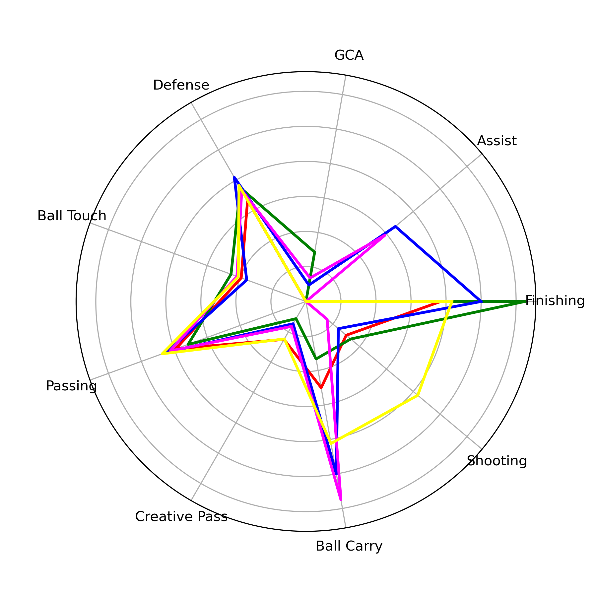
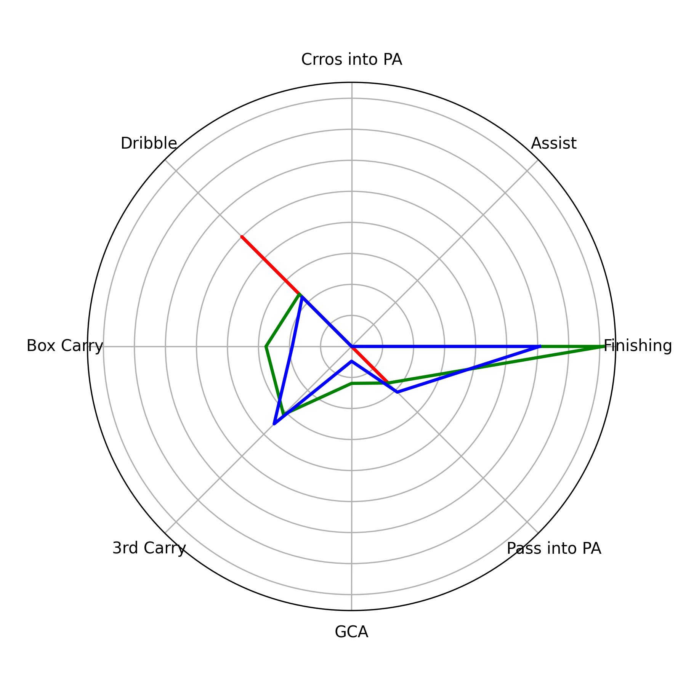

# :soccer: Where Gakpo ⁉
21101203 위동국 OSS Project

### 프로젝트 주제
코디 각포의 최적의 포지션은 어디인가
* 평소 프리미어리그의 축구 클럽 리버풀의 열렬한 팬으로써 경기를 챙겨보던 중 코디 각포 선수가 여러 포지션에서 뛰는 모습을 보고 과연 어떤 포지션이 최고의 경기력을 보여줄 수 있는 최적의 포지션인지 궁금증이 생겨 시작하게 되었습니다.

### 사용한 오픈소스 라이브러리
* Pandas
* Numpy
* Matplotlib
* re
* os

### 사용한 데이터
* FBREF https://fbref.com/en/에서 코디 각포 선수의 Match Log를 스크래핑 하여 사용했습니다.
* 11/25일까지의 22-23시즌 리그 경기와 유로파 경기의 데이터만 사용했습니다.

### 포지션별 데이터 시각화 및 분석
코디 각포 선수는 리버풀에서 포워드, 윙, 미드필더 총 세가지 포지션으로 경기를 뛰었습니다.

이 세 포지션이 공통으로 중요하다고 생각하는 스텟들을 경기를 뛴 시간 대비 얼마나 쌓았나 비교해보았습니다.

##### Scatter Plot

아래의 Scatter Plot에서 빨간색이 포워드, 초록색이 미드필더, 파란색이 윙을 나타냅니다.

1. 공격 포인트

|Goal|Asist|Shot|Shot On Target|Shot Creating Action|
|---|---|---|---|---|
||||||

FW와 MID에서 각각 1골, FW에서 1어시를 적립하였고, 같은 시간을 뛰었을 때 LW에서 슈팅이 더 많지만 유효슈팅은 비슷하다는 것을 알 수 있었습니다. 

2. 패스

|Pass Complete Percent|Progressive Pass|Pass Final 3rd|Pass Penalty Area|Key Pass|
|---|---|---|---|---|
||||||

같은 시간을 뛰었을 때 평균적으로 MID에서 패스정확도, 전진패스, 파이널 써드 지역으로 패스, 패널티 지역으로 패스, 키패스 횟수 모두 높다는 것을 알 수 있었습니다.

3. 볼 운반

|Progressive Carry Distance|Progressive Carry|Carry Final 3rd|Carry Penalty Area|
|---|---|---|---|
|||||

Progressive Carry란 쉽게 말하면 전진 드리블, 보다 정확한 의미는 "상대진영에서 골라인을 향해 적어도 10야드 볼 이동" 입니다. 

볼 운반 또한 같은 시간을 뛰었을 때 MID에서의 스텟이 평균적으로 높다는 사실을 알 수 있었습니다.

4. 볼 컨트롤

|Take-Ons|Progressive Recieive|Touch Final 3rd|Touch Penalty Area|
|---|---|---|---|
|||||

Take-Ons란 완전히 등 뒤로 재친 수비수의 숫자를 의미합니다.

볼 컨트롤 부분에서는 같은 시간을 뛰었을 때 세 포지션이 비슷한 스텟을 가지지만, FW가 약간 높은 수치를 보인다는 것을 알 수 있었습니다.

##### Radar Plot

Scatter Plot을 통해 포지션별 스텟을 비교하였을 때, 각 포지션이 뛴 시간도 다르고, 데이터의 개수도 달라서 정확한 비교가 어렵다고 생각하여 데이터를 가공하여 Radar Plot으로 비교해보고자 하였습니다.

아래의 Radar Plot은 각 스텟을 90당 기록으로 계산하여 만들었습니다. 

Scatter와 동일하게 빨간색이 포워드, 초록색이 미드필더, 파란색이 윙을 나타냅니다.

'Finishing'은 90당 기대득점 대비 득점, 'Assist'는 90당 기대 어시스트 대비 어시스트, 'Passing'은 90당 패스 시도 대비 패스 성공, 'Dribbling'은 90당 Take-on 시도 대비 성공, 'Prg Passing' 90당 패스 성공 대비 전진 패스, 'Touches' 90분 당 터치 대비 파이널 써드에서의 터치, 'Prg Carry' 90분 당 볼 운반 대비 전진 드리블, 'Shooting'은 90분당 슈팅 대비 유효슈팅을 의미합니다.

Radar Plot을 보면 LW에서는 드리블을 제외한 모든 스텟에서 상대적으로 밀리는 것을 알 수 있고,  FW에서 드리블을 제외하고 전체적으로 비슷하거나 높은 수치를 기록한다는 사실을 알 수 있습니다. 

하지만 MID에서도 어시스트를 제외한 모든 스텟에서 준수한 능력치를 보여주기 때문에 이 정보들만으로는 어느 포지션이 최적의 포지션이라고 판단하기에는 부족하다고 생각하였습니다. 

그래서 보다 정확한 분석을 위해 같은 팀에서 뛰는 다른 선수들과 비교해보았습니다.

### 선수별 데이터 시각화 및 분석

코디 각포 선수와 같은 팀에서 뛰는 동포지션의 선수들의 스텟 중에서 각 포지션에서 중요하다고 생각되는 스텟들만 가공하여 Radar Plot을 통해 비교해보았습니다.

1. FW

* 빨간색이 코디 각포, 초록색이 디오구 조타, 파란색이 다르윈 누녜즈를 나타냅니다.
* 'Finishing'은 90당 기대득점 대비 득점, 'Assist'는 90당 기대 어시스트 대비 어시스트, 'BOX Touch'는 90분 당 터치 대비 패널티 박스 안 터치, '3rd Touch'는 90분 당 터치 대비 파이널 써드에서의 터치, 'Box Carry'는 90분 당 전진 드리블 대비 패널티 박스로의 드리블, '3rd Carry'는 90분 당 전진 드리블 대비 파이널 써드로의 드리블, 'GCA'는 90분 당 SCA 대비 GCA, 'Shooting'은 90분 당 슈팅 대비 유효슈팅을 의미 합니다.

* 코디 각포 선수의 경우 공격 포인트와 밀접한 Assist, Finising에서 다른 선수에 비해 눈에 띄게 높은 수치를 보여줍니다.
* 디오구 조타 선수의 경우 다른 스텟에서는 밀리는 모습이지만, Finising에서는 눈에 띄게 높은 수치를 기록하였습니다.
* 다르윈 누녜즈 선수의 경우 다른 선수에 비해 눈에 띄게 높은 수치를 기록한 스텟은 없지만, 전체적으로 준수한 수치를 보여줍니다.

2. MID
* 빨간색이 코디 각포, 초록색이 커티스 존스, 파란색이 도미니크 소보슬러이, 분홍색이 하비 엘리엇, 노랑색이 라이언 흐라벤베르흐를 나타냅니다.
* 'Finishing'은 90당 기대득점 대비 득점, 'Assist'는 90당 기대 어시스트 대비 어시스트, 'GCA'는 90분 당 SCA 대비 GCA, 'Defense'는 90분 당 태클 시도와 인터셉트 대비 태클 성공과 인터셉트, 'Ball Touch'는 90분 당 터치 대비 파이널 써드에서의 터치, 'Passing'은 90당 패스 시도 대비 패스 성공, 'Creative Pass'는 90분 당 패스 성공 대비 파이널 써드와 패널티 박스로의 패스랑 키패스, 'Ball Carry'는 90분 당 전진 드리블 대비 파이널 써드로의 드리블, 'Shooting'은 90분 당 슈팅 대비 유효슈팅을 의미 합니다.

* 코디 각포 선수의 경우 전체적으로 다른 선수들에 비해 부족한 수치를 기록하였습니다.
* 커티스 존스 선수의 경우 "Finishing", "GCA" 등 골과 괸련해서는 다른 선수에 비해 눈에 띄게 높은 수치를 보여주는 반면, 나머지 스텟은 낮은 수치를 기록하였습니다.
* 도미니크 소보슬러이 선수의 경우 다른 선수에 비해 눈에 띄게 높은 수치를 기록한 스텟은 없지만, 전체적으로 준수한 수치를 보여줍니다.
* 하비 엘리엇 선수의 경우 볼 운반에서 좋은 수치를 보여주지만 골결정력은 0에 가까운 수치를 기록하였습니다. 나머지 다른 스텟에서는 준수한 수치를 보여줍니다.
* 라이언 흐라벤베르흐 선수의 경우 어시스트와 GCA에 대해서는 0에 가까운 수치를 기록하였지만, 나머지 다른 스텟, 특히 슈팅에서는 다른 선수들에 비해 높은 수치를 보여줍니다.

3. LW
* 빨간색이 코디 각포, 초록색이 디오구 조타, 파란색이 루이스 디아즈를 나타냅니다.
* 'Finishing'은 90당 기대득점 대비 득점, 'Assist'는 90당 기대 어시스트 대비 어시스트, 'Cross into PA'는 90분 당 크로스 대비 패널티 박스 안으로의 크로스, 'Dribble'은 90당 Take-on 시도 대비 성공, 'Box Carry'는 90분 당 전진 드리블 대비 패널티 박스로의 드리블, '3rd Carry'는 90분 당 전진 드리블 대비 파이널 써드로의 드리블, 'GCA'는 90분 당 SCA 대비 GCA, 'Pass into PA'는 90분 당 전진 패스 대비 패널티 박스 안으로의 패스를 의미 합니다.

* 코디 각포 선수의 경우 "Dribble"에서 다른 선수들에 비해 높은 수치를 보여주었지만, 다른 스텟들은 굉장히 낮은 수치를 기록하였습니다.
* 디오구 조타 선수의 경우 전체적으로 다른 선수들에 비해 높은 수치를 보여주었습니다.
* 루이스 디아스 선수의 경우 전체적으로 다른 선수들과 비교했을 때 준수한 스텟을 보여줍니다.
* 코디 각포 선수가 다른 선수들에 비해서 좋지 않은 기록을 보여준 이유는 LW로 경기를 뛴 시간이 다른 선수들에 비해 굉장히 적기 때문에 분석할만한 충분한 데이터가 쌓이지 않았다고 생각합니다.
* 그래서 LW에서의 능력을 분석하는 것은 어렵다고 생각하여 제외하기로 결정하였습니다.

### 결론
* 데이터도 부족하고 전체적으로 스텟에서 낮은 수치를 기록한 LW를 제외하고 FW와 MID 두 포지션을 비교해 보았습니다.
* 코디 각포가 선수가 각 포지션으로 뛰었을 때의 스텟을 비교해보면 FW에서는 공격포인트와 관련되어 특화된 모습을 볼 수 있고, MID에서는 어시스트를 제외하고 전체적으로 준수한 스텟을 보여줍니다.
* 동포지션의 다른 선수들과 비교하면 FW에서는 여전히 공격포인트와 밀접한 스텟에서 특화된 모습을 보여주지만, MID에서는 다른 선수들에 비해서는 낮은 스텟을 보여줍니다.
* 따라서 코디 각포 선수의 최적의 포지션은 FW라는 결론을 내릴 수 있었습니다.

